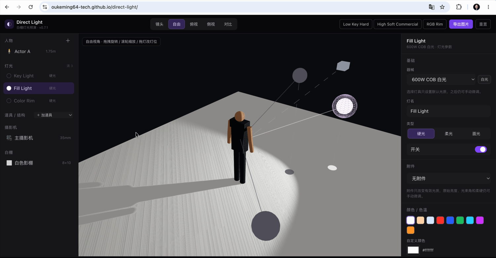
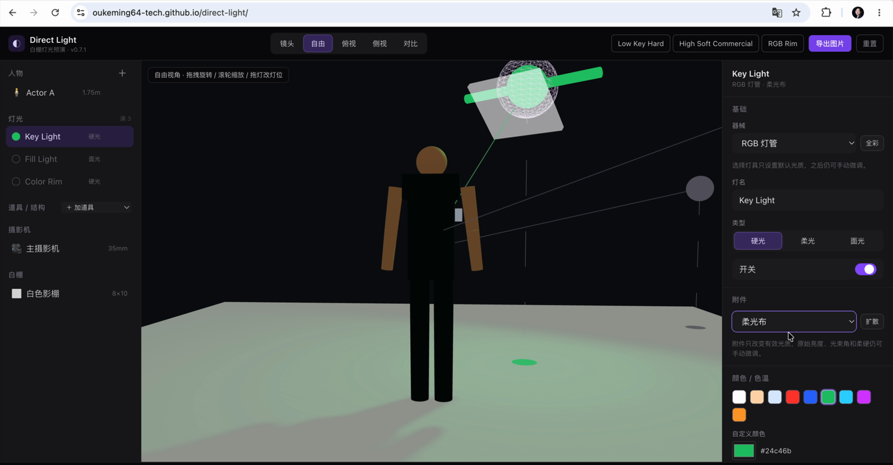
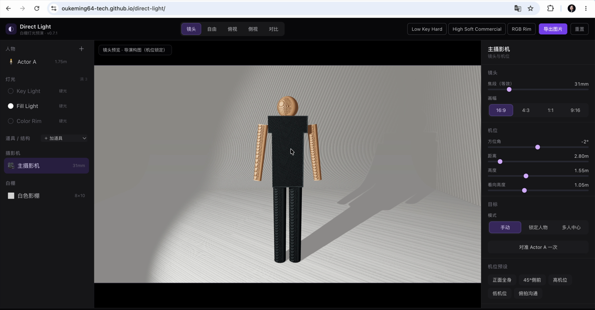

# Direct Light · 白棚灯光预演

[](https://oukeming64-tech.github.io/direct-light/showcase/)
[](https://oukeming64-tech.github.io/direct-light/)
[](https://github.com/oukeming64-tech/direct-light/releases)
[](https://tauri.app/)
[](LICENSE)

> 面向导演、摄影指导和灯光师的白棚灯光预演沙盘。在标准白色影棚里，实时预览人物站位、灯位、灯具、控光附件、白光与彩色光对人物和阴影的影响。
>
> A white-studio lighting previz sandbox for directors, DPs, and gaffers. 👉 English readme: [`README.en.md`](README.en.md)

- 🧭 项目展示页：<https://oukeming64-tech.github.io/direct-light/showcase/>
- 🌐 在线 demo：<https://oukeming64-tech.github.io/direct-light/> —— 免安装，工作台需至少 960px 宽；窄屏会给出横屏 / 扩窗提示，随 `main` 自动更新。
- 🖥️ macOS 桌面版：[Releases](https://github.com/oukeming64-tech/direct-light/releases/latest) 的 `.dmg`（Apple Silicon / Intel 通用）。

> 发现灯光、阴影或交互不符合预期？欢迎[提交问题或视觉反馈](https://github.com/oukeming64-tech/direct-light/issues/new/choose)。有布光方案、片场工作流或还不成熟的想法，也欢迎到 [Discussions](https://github.com/oukeming64-tech/direct-light/discussions) 交流；不需要会写代码。

纯前端 Web 应用，无后端依赖。强调**沟通向、实时、可读**，而不是物理级精确渲染——区别于重型 3D / 付费布光软件，它即开即用、专为前期和团队沟通灯光方案而做。


> *调整摄影机机位 → 切到「镜头」视角，相机实拍画面随之实时变化。*

## 当前状态

当前公开版本：**`v1.0.5`**。白棚灯光预演的核心功能已全部就绪，并完整支持简体中文 / English / 日本語 运行时切换。

- `v1.0.0`：首个正式大版本，多语言 UI。
- `v1.0.1`：自由拖动按白棚尺寸夹紧。
- `v1.0.2`：用户自定义 `.glb` 人像模型。
- `v1.0.3`：阴影漏光修复（每盏灯「法线偏移」滑杆 + 「柔和阴影 (PCF)」开关）。
- `v1.0.4`：五步新手导览、键盘/读屏体验、A/B 正确性、本地保存失败反馈、器械/人物模型兼容与生产拆包收口。
- `v1.0.5`：优化日文界面的自然度与可读性；不改架构、场景数据或渲染行为。

完整逐版更新见 [`CHANGELOG.md`](CHANGELOG.md)。

## 功能特性

- 🎬 **白棚 + 人物**：可调白棚（尺寸、墙/顶开关、无缝弧形背景、墙地反射），层级骨架假人，多人站位（上限 5），姿态预设与关键关节微调。
- 🧍 **用户自定义人像模型**：把 `.glb` 放进 `src/models/` 即自动出现在「外观 → 用户模型」列表，运行期自动缩放落地、无需逐模型配置。默认仍是程序化假人。
- 💡 **灯光系统**：最多 6 盏灯（硬光 / 柔光 / 面光），可调位置、高度、距离、角度、亮度、颜色、色温、光束角、柔硬；拖拽灯位；目标锁定（手动 / 锁定人物 / 多人中心）。
- 🔦 **灯具预设库**：8 个器械语义预设（COB、Nanlux Evoke 600C、LED 面板、RGB 灯管、菲涅尔等），一键套用后仍可手动微调。
- 🎛️ **控光附件 + 棚内器材**：柔光箱 / 蜂巢 / 反光罩 / 柔光布 + 黑旗 / 反光板 / 柔光布框，带导演可读的近似光学。
- 🏠 **道具与结构**：桌椅 / 台座 / 人台 / 直播圆台 / 背景板等，可拖动、旋转、改尺寸/材质；人物可放到承载物上实时跟随。
- 🎥 **多视图 + 摄影机**：镜头 / 自由 / 俯视 / 侧视；摄影机方位角、距离、高度、焦段、画幅、机位预设、从自由视角取景。
- 🔀 **A/B 对比 · 保存 · 导出**：方案存到浏览器 localStorage，A/B 冻结对比带差异摘要，导出预览图用于团队沟通。
- 🌐 **多语言 UI**：运行时切换简体中文 / English / 日本語；语言只影响界面显示，不写入场景、保存方案、A/B 或自定义器械数据。
- 🧭 **首次导览 + 键盘操作**：五步认识「选对象 → 看画面 → 调参数 → 存方案 → 导出」，可跳过、随时从 `?` 重看；核心对象行和参数控件支持键盘与读屏状态。

## 截图

| 灯位放低 → 地面投影拉长 | 彩色光染白整个白棚 | 切到摄影机镜头视角 |
| :---: | :---: | :---: |
|  |  |  |

## 快速开始

不想本地跑？直接打开 [在线 demo](https://oukeming64-tech.github.io/direct-light/) 即可。本地开发需要 **Node.js >= 20.19**：

```bash
npm install
npm run dev        # http://localhost:5173
```

打开后即是一个可用的默认白棚场景（一个人物 + Key/Fill/Rim 三盏灯 + 摄影机）。拖动灯、调高度、换颜色、加道具，画面与阴影实时变化。

常用脚本：

```bash
npm run lint
npm run build        # tsc -b 类型检查 + vite 生产构建到 dist/
npm run build:tauri  # 打包 macOS 桌面版
```

桌面版未签名，首次打开被拦时：系统设置 → 隐私与安全性 → 拉到底 →「仍要打开」。

## 技术栈

Vite · React 19 · TypeScript · React Three Fiber + drei（Three.js）· Zustand · Tailwind CSS · Tauri（桌面封包）。

## 项目结构

| 目录 | 职责 |
| --- | --- |
| `src/app` | 应用外壳与布局、舞台、A/B 对比 |
| `src/scene` | Three.js / R3F 3D 内容（白棚、人物、灯组、器材、相机 rig） |
| `src/state` | Zustand store（薄组合 + `actions/*` 工厂） |
| `src/data` | 纯数据与规格（默认场景、渲染数值、灯具/附件/姿态/机位预设） |
| `src/domain` | 纯业务计算（相机数学、器材光学、场景 diff/迁移、灯光简介） |
| `src/ui` | 右侧参数面板、对象列表、顶栏 |
| `src/lib` | 通用工具（颜色、几何、localStorage） |

完整模块边界见 [`ARCHITECTURE.md`](ARCHITECTURE.md)，贡献流程见 [`CONTRIBUTING.md`](CONTRIBUTING.md)。

## 已知限制与设计取舍

- 最多 6 盏灯（`MAX_LIGHTS = 6`）；默认场景仍是 Key/Fill/Rim 三盏。
- 自定义灯具器械只存本地 localStorage，跨设备 / 分享需用「导出 / 导入」手动搬运。
- 桌面 / 工作台体验优先；960px 以下会显示明确的扩窗提示，完整移动端工作区后续单独排期。
- 渲染是导演沟通向近似，不是物理准确模拟：白棚反射、柔光、彩色溢光和控光器材光学都以可读、稳定、实时为先。

## 参与项目

Direct Light 欢迎导演、摄影指导、灯光师、3D / Web 开发者以及只是对布光好奇的人参与。你可以：

- 在在线 demo 里复现问题，通过 [Issue 表单](https://github.com/oukeming64-tech/direct-light/issues/new/choose)附上步骤、截图或录屏。
- 在 [Discussions](https://github.com/oukeming64-tech/direct-light/discussions) 分享布光方案、真实片场需求和仍需讨论的想法。
- 查看[开放中的 Issues](https://github.com/oukeming64-tech/direct-light/issues)，选择已经说明范围的工作，再按 [`CONTRIBUTING.md`](CONTRIBUTING.md) 提交 PR。

路线图里的候选方向不等于已经决定的功能。较大的改动请先开 Issue 或 Discussion 对齐问题与范围；小而明确的 bug 修复可以直接提交 PR。

## 文档地图

当前入口：

- [`COLLABORATION.md`](COLLABORATION.md) — 当前状态、工作边界、文档地图。
- [`ARCHITECTURE.md`](ARCHITECTURE.md) — 当前代码边界。
- [`RENDERING_SPEC.md`](RENDERING_SPEC.md) — 当前渲染口径。
- [`ROADMAP.md`](ROADMAP.md) — 当前路线。
- [`CHANGELOG.md`](CHANGELOG.md) — 面向用户的版本记录。
- [`CONTRIBUTING.md`](CONTRIBUTING.md) — 贡献说明。

历史归档（含完整旧 README + 整本 PRD、旧路线图 / 架构 / 渲染规格）：

- 归档总览：[`docs/history/README.md`](docs/history/README.md)
- 完整旧 README + PRD：[`docs/history/snapshots/README_FULL_2026-06-29.md`](docs/history/snapshots/README_FULL_2026-06-29.md)
- 阶段规格：[`docs/history/specs/`](docs/history/specs/)

## 许可证 · 致谢

- 许可证：[MIT](LICENSE)
- 致谢：特别感谢斯坦福的 Dr. Zhang（[@zczam](https://github.com/zczam)）贡献用户自定义人像模型，让无聊的白棚多了一些哲学和地牢的气息。
